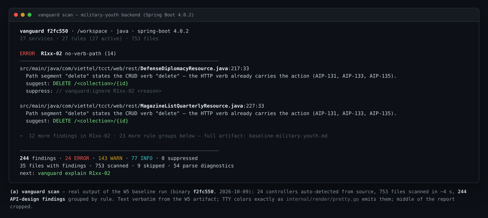
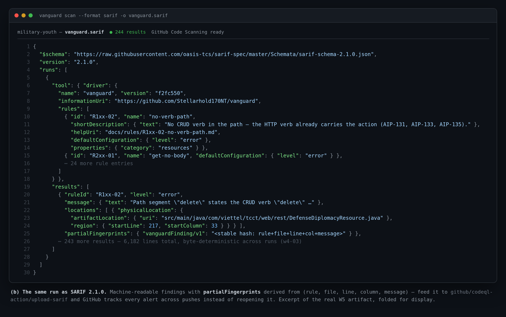
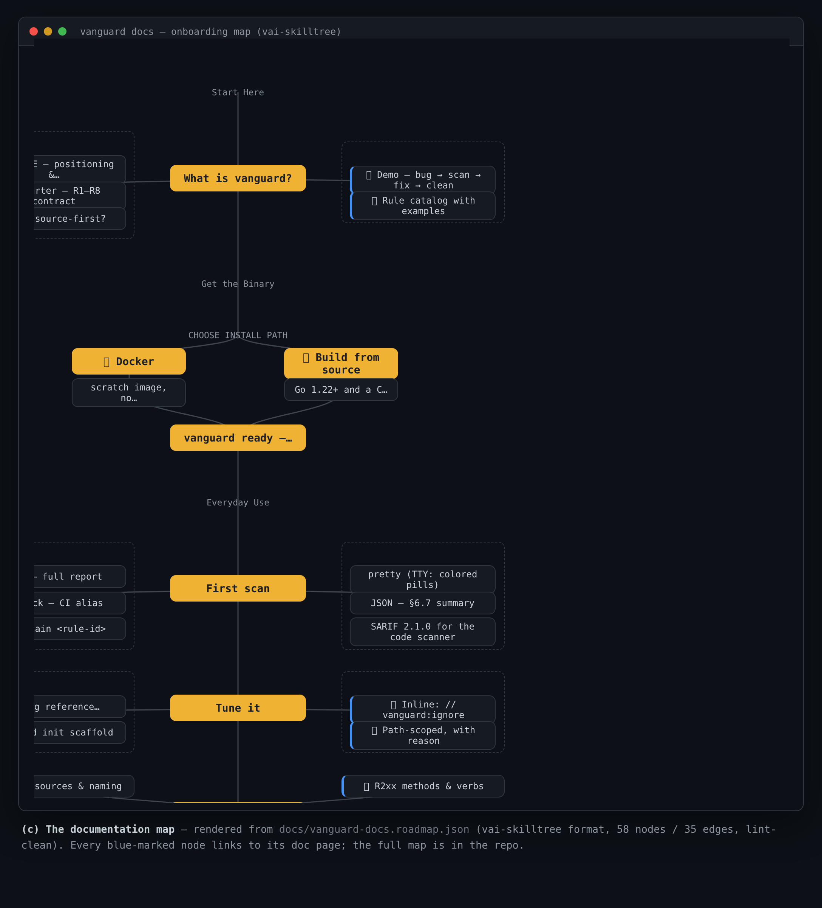

<div align="center">
  

  <h1>Vanguard</h1>

<p align="center">
  <a href="https://github.com/Stellarhold170NT/vanguard/actions/workflows/ci.yml"></a>
  <a href="LICENSE"></a>
  <a href="https://github.com/Stellarhold170NT/vanguard/releases"></a>
  <a href="https://pkg.go.dev/github.com/Stellarhold170NT/vanguard"></a>
  <a href="docs/ci-integration.md"></a>
</p>

  <hr />
</div>

**Source-first API design linter — scans source code directly, auto-detects the REST + gRPC API surface, and checks API design against AIP-style (resource-oriented design) rules with precise `file:line:col` findings.**

**Status: v0.1.0.** The engine, 27 rules, Java/Spring + gRPC adapters, Docker image and release pipeline are built, verified and shipped as the first tagged release. Track the working contract in [docs/charter.md](docs/charter.md).

[Quickstart](#quickstart) · [Demo](#demo) · [Documentation](#documentation) · [Rule catalog](#the-rule-catalog)

## Why vanguard

Spec linters (spectral, speccy) only see the OpenAPI document that is generated after the service builds and runs — one loop too late, and with locations that no longer map to source. Vanguard reads the source directly:

```bash
vanguard scan /path/to/project   # no build, no spec, no file list
```

| Feature | What it enables | Learn more |
|---------|-----------------|------------|
| **Source-first** | Parses Java/Spring and `.proto` files, auto-detects the API surface (REST + gRPC), no spec file required. | [Charter](docs/charter.md) |
| **Design-standard rules** | 27 rules across naming, verb semantics, pagination, payload schema, error model, versioning and gRPC conventions, each traceable to an [AIP](https://google.aip.dev/) guideline. | [Rule catalog](docs/rules/README.md) |
| **CI-native** | Pretty / JSON / SARIF 2.1.0 output, exit code contract `0 / 1 / 2`, deterministic reports, `partialFingerprints` for stable GitHub alerts. | [CI integration](docs/ci-integration.md) |

Where vanguard sits relative to the ecosystem (charter §1.2): **spec governance** stays with spectral, **breaking-change detection** with oasdiff/buf, **language linting** with golangci-lint/Checkstyle — vanguard owns the layer none of them cover: *the API design standard, checked in source, before the spec exists.*

## Quickstart

Requirements:

- Docker (recommended — no Go toolchain needed; the image build pins its own)
- Go ≥ 1.22 **and** a C toolchain (only for building from source — the tree-sitter grammar is cgo; see [docs/install.md](docs/install.md))

### Scan with Docker

```bash
git clone https://github.com/Stellarhold170NT/vanguard && cd vanguard
docker build -t vanguard:local .
docker run --rm -v "$PWD/testdata/stub-repo:/src:ro" vanguard:local scan /src
```

### Or build the CLI directly

```bash
go build -o vanguard ./cmd/vanguard
./vanguard scan testdata/stub-repo
./vanguard scan testdata/audit-sample --format sarif -o vanguard.sarif
./vanguard explain R4xx-02
./vanguard init               # scaffold a commented .vanguard.yaml
```

What you will see — real output of `scan testdata/stub-repo` (the bundled demo repo carries one deliberate violation):

```text
 vanguard 0.1.0-dev · testdata/stub-repo · stub · stub-http
 1 services · 27 rules (27 active) · 3 files

 [WARN]  R4xx-02 field-casing (1)
 ──────────────────────────────────────────────────────────────────
 src/orders.stub.json:1:1
   Field "total_amount" is not lowerCamelCase — the payload JSON convention is lowerCamelCase.
   suggest: totalAmount
   suppress: // vanguard:ignore R4xx-02 <reason>

 ──────────────────────────────────────────────────────────────────
 1 findings · 0 ERROR · 1 WARN · 0 INFO · 0 suppressed
 1 files with findings · 3 scanned · 3 skipped · 2 parse diagnostics
 next: vanguard explain R4xx-02
```

Exit codes (`vanguard check` is the CI alias):

| Code | Meaning |
|---|---|
| `0` | clean, warnings-only, or no API surface found |
| `1` | at least one **ERROR**-severity finding survived config/suppressions |
| `2` | tool or config error (bad flag, unreadable/invalid `.vanguard.yaml`, …) |

## Demo

A 60-second tour — repo with a bug, scan, explanation, fix, clean rescan — lives in [docs/demo.md](docs/demo.md). Highlights:

<p align="center">
  
  <br><em>(a) <code>vanguard scan</code> on a 753-file Spring backend — 24 controllers, 244 design findings grouped by rule (W5 baseline artifact, TTY colors per <code>internal/render/pretty.go</code>)</em>
</p>
<p align="center">
  
  <br><em>(b) the same run as SARIF 2.1.0 — GitHub Code Scanning ingests this file directly (docs/ci-integration.md §2)</em>
</p>
<p align="center">
  
  <br><em>(c) the documentation map (vai-skilltree format, docs/vanguard-docs.roadmap.json)</em>
</p>

## Documentation

The full set is mapped in the docs roadmap above; the pages:

- [docs/demo.md](docs/demo.md) — end-to-end walkthrough: bug → scan → explain → fix → clean
- [docs/install.md](docs/install.md) — three install paths (Releases / Docker / go install), each step verified
- [docs/config.md](docs/config.md) — `.vanguard.yaml` schema v1: discovery, rule overrides, suppressions, error contract
- [docs/rules/README.md](docs/rules/README.md) — the rule catalog — one page per rule, CI-enforced 1:1 with `--list-rules`
- [docs/ci-integration.md](docs/ci-integration.md) — gate integration: exit-code contract, GitHub Actions / GitLab recipes, SARIF upload
- [docs/charter.md](docs/charter.md) — product charter: R1–R8 requirements, rule taxonomy, architecture
- [CONTRIBUTING.md](CONTRIBUTING.md) — development setup and the process for adding a rule

## The rule catalog

27 registered rules in six families (full index with quick examples: [docs/rules/README.md](docs/rules/README.md), machine-readable via `vanguard scan --list-rules`):

| Family | Rules | Checks | Severity mix |
|---|---|---|---|
| **R1xx** resources & naming | 5 | plural collections, CRUD verbs in paths, path shape and casing, id naming | 1 ERROR · 3 WARN · 1 INFO |
| **R2xx** methods & verbs | 6 | GET bodies, POST→201, PATCH/PUT payloads, DELETE bodies, custom methods | 1 ERROR · 4 WARN · 1 INFO |
| **R3xx** pagination | 3 | unpaginated lists, list envelopes, unbounded page size | 1 WARN · 2 INFO |
| **R4xx** payload | 3 | entities in payloads, field casing, time field types | 1 ERROR · 1 WARN · 1 INFO |
| **R5xx** errors | 3 | unified error shape, no 500 for business errors, status semantics | 1 ERROR · 2 WARN |
| **R6xx** http-grpc & versioning | 7 | versioned paths, gRPC standard methods, + 5 golden-fixture demo rules | 1 ERROR · 1 WARN · 5 demo |

Rules are config-tunable per family or per id (`rules.R1xx-02.severity`), and every finding can be suppressed inline (`// vanguard:ignore R4xx-02 <reason>`) or path-scoped in config with a reason — see [docs/config.md](docs/config.md).

## Repository layout

| Path | Responsibility |
|---|---|
| `cmd/vanguard/` | CLI entry point |
| `internal/ir/` | `ApiSurface` IR — pure, language-agnostic (w2-02) |
| `internal/engine/` | rule engine, registry, suppression (w2-04) |
| `internal/render/` | pretty / JSON / SARIF output (w2-05) |
| `internal/discovery/` | tree walker, language detection, adapter registry (w2-03) |
| `adapters/java/` | Java/Spring adapter (w3-01, w3-02) |
| `rules/` | R1xx–R6xx rule metadata + check functions (w3-03..w3-06) |
| `testdata/` | stub-repo, golden, adversarial, mutation corpora |
| `docs/` | charter, test strategy, per-rule documentation |
| `reference/api-linter/` | local study clone of googleapis/api-linter — not committed |

## License

This project is open source under the [Apache-2.0 License](LICENSE) — the same license as [googleapis/api-linter](https://github.com/googleapis/api-linter), the spiritual ancestor of the rule model.
